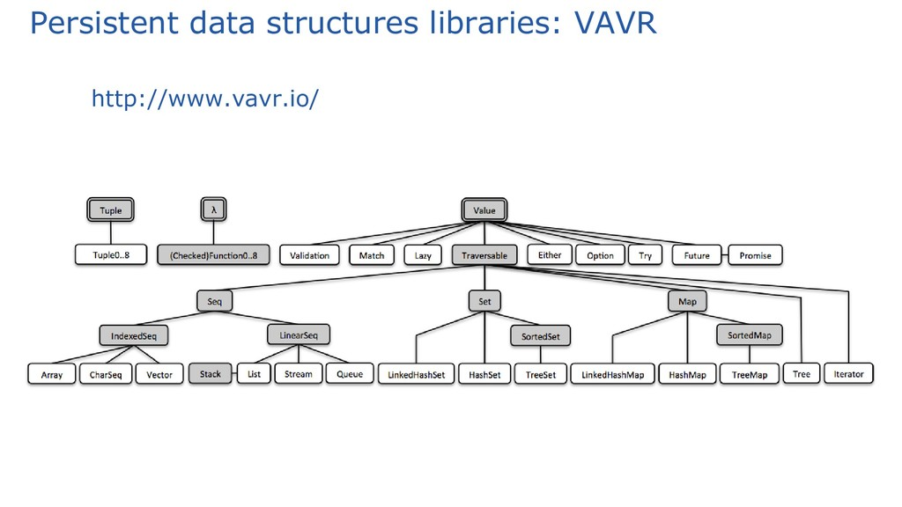

# Either class - A look at functional programming structures

## Goals

Below you can find the objectives for which this repository has been created:

1. Give a humble tech talk which explores Either class from the vavr.io library. See more details in [Vavr User Guide](https://docs.vavr.io/)
2. Demonstrate the existence and use of Either class.
3. Review the use cases in which "persistent data types and functional control structures" have an advantage.
4. Explain the advantage of functional programming paradigm to create more readable applications.
5. Invite to innovate, change or modify developments from small details that allow more coherence and cleanliness to your code.

## How to get the message from this repository (Tech Talk)

1. Locate the slide [Exploring Vavr's Either Java's Alternative to Scala's Either](./doc/slide/Exploring%20Vavr's%20Either%20Java's%20Alternative%20to%20Scala's%20Either.pdf) and read it taking into account the following point.
2. In the slides you can find three types of slides:
   1. **First type - Theoretical content slide:** The concepts surrounding the Either class are presented there.
   2. **Second type - Slido Type:** Slides to confront knowledge:
      1. [Initial Quiz about Handle Exceptions and use of Either](./doc/quiz/Initial%20Quiz%20about%20Handle%20Exceptions%20and%20use%20of%20Either.docx), where concepts and terms that will be worked on throughout the presentation are reviewed.
      2. [Final Quiz about Handle Exceptions and use of Either](./doc/quiz/Final%20Quiz%20about%20Handle%20Exceptions%20and%20use%20of%20Either.docx), where the minimum concepts that you are expected to end up with when using this repository are evaluated.
   3. **Third type - code Type:** To do this, use the tags mentioned in this type of slides.
      1. [Here](https://github.com/EdisonGonzalez/either_use_cases_check/tags) are the tags at the level of this repository.
      2. Note that to interact with each use case a separate [postman collection](./doc/postman/Either%20Explanation.postman_collection.json) has been created, with the same tag versions of the code.
      3. It is worth clarifying that the previous interaction explains the dependencies of Spring Web and Spring Data in the project.
3. Please don't forget to reinforce the knowledge presented there, it will help you internalize the topic discussed here.

## 👨‍🎓💻👩‍🎓🖥️⌨️🖱️
Note: If you want to create a fork, reuse this content for educational and practical purposes, welcome. Enjoy it.

#### Created by Edison González
#### Revision by Juan Carlos Calderón

